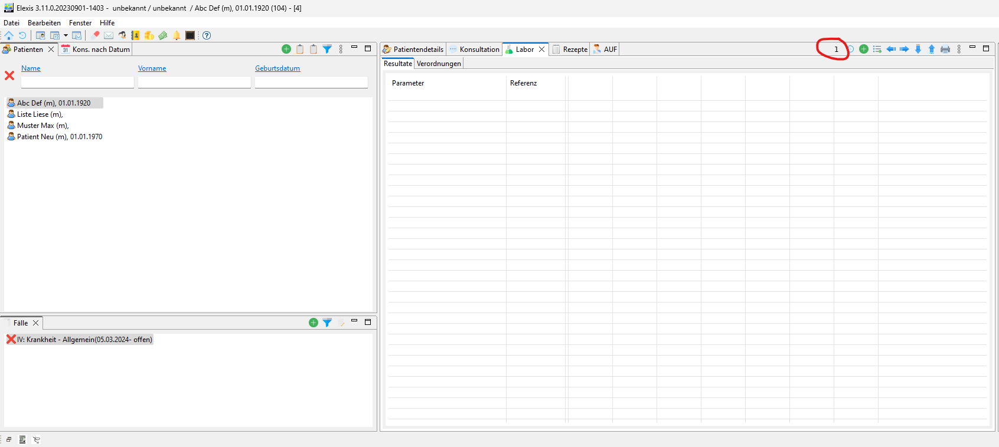

# LG1 laboratory order via medicalvalues

This plugin allows the creation of laboratory orders via the medicalvalues api for the LG1 order entry system.

## Configuration

The plugin will make HTTP calls to `https://oe.lg1.lan/`.
This URL needs to be accessible from the system where the Elexis installation is running.

## Usage

The plugin can be used in Elexis on the Laboratory view if a patient and a corresponding encounter are selected.
The button simply shows the LG1 logo.

After clicking the button, the systems standard browser will open a new tab with the LG1 order entry system (maybe login
is required first). If logged in, an empty order will be created with the transmitted patient, coverage and encounter data.
