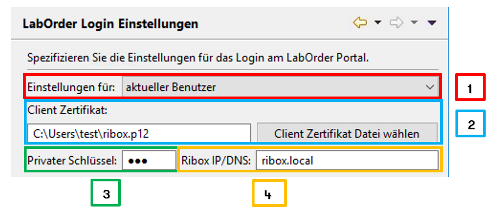
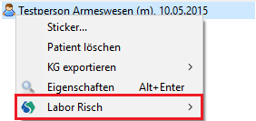
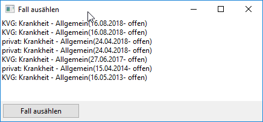

#Übersicht
Das Plugin ermöglicht die elektronische Auftragserfassung beim labormedizinischen zentrum Dr Risch über die [LabOrder Schnittstelle](https://www.risch.ch/de/elektronische-auftraege/laborder).

#Konfiguration
Das Plugin wird mit Elexis über den Menüpunkt *Datei* &rarr; *Online-Dienste* &rarr; *LabOrder Login Einstellungen* konfiguriert:

1. In diesem Dropdown kann der Geltungsbereich der Einstellungen definiert werden. Es gibt folgende 3 Optionen:
   * aktueller Benutzer: Einstellungen gelten ausschliesslich für den aktuellen Benutzer
   * aktueller Mandant: Einstellungen gelten ausschliesslich für den aktuellen Mandanten
   * Global: Einstellungen gelten im Elexis global
2. Der Pfad der p12-Datei. Dies muss ein Pfad sein, welcher für den Client erreichbar ist. Es empfiehlt sich die p12-Datei an einem zentralen Ort abzuspeichern. Jedoch muss der Pfad stets erreichbar sein, ansonsten kommt es zu Fehlern.
3. Das Passwort(also der Private Key) der p12-Datei muss hier hinterlegt werden.
4. Die IP-Adresse oder der DNS Name der Ribox muss hier hinterlegt werden.

#User Guide
Um Laboraufträge zu erstellen oder anzeigen zu lassen, muss in der Patientenübersicht der gewünschte Patient selektiert werden. Ein Rechtsklick auf den Patient öffnet ein Dropdown-Menü:

Der Menüpunkt *Labor Risch* bietet folgende Optionen:
1. __Laborauftrag erstellen__

   Erstellt einen neuen Laborauftrag. Dafür muss mindestens 1 Fall offen sein. Falls mehrere Fälle offen sind, muss der gewünschte Fall selektiert werden: 
2. __Auftragsübersicht__

   Es werden die Laboraufträge des selektierten Patienten angezeigt.
   
#Technische Einschränkung
Das Plugin funktioniert aktuell nur auf Windows Plattformen.