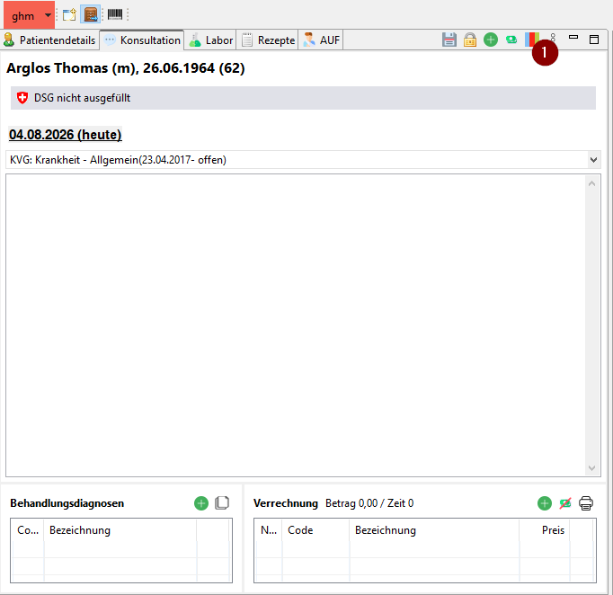
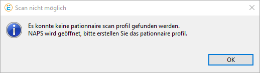
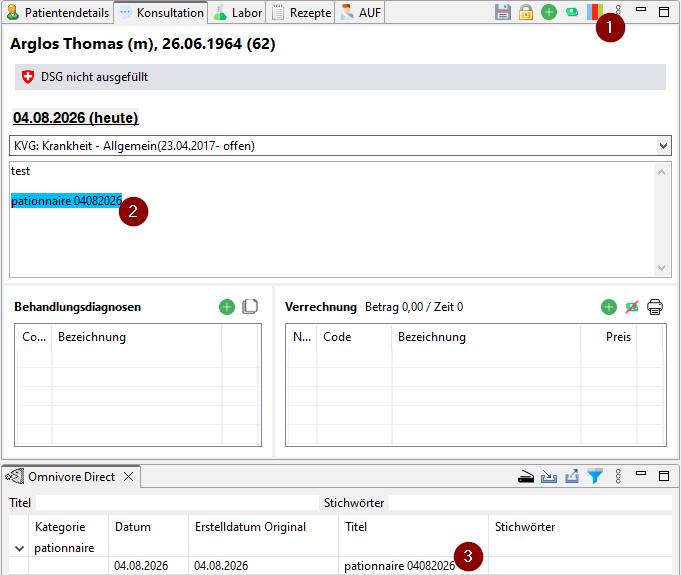
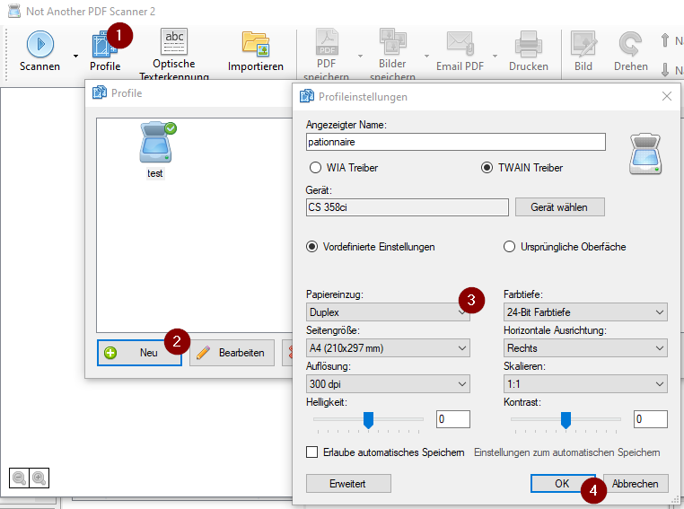

# Integration des pationnaire Diagnostik Fragebogen in Elexis
*Version 1.0.0   Last Updated: August 6, 2026*

## Installation

### Voraussetzungen
- Medelexis Installation inklusive Dokumente Scan
- Im Betriebssystem installierter Scanner

### Schritte
1. Elexis starten und einloggen mit Benutzer der die Berechtigung für das  _Abo Management_  hat 
2. Die Perspektive  _Abo Management_  öffnen
3. Auf der Ansicht  _Service Abo_  unter _KG-Führung_ den Punkt  _Pationnaire in Elexis_  anwählen
4. Mit  _Änderungen übernehmen_  bestätigen
5. Elexis neu starten

## Verwendung

### Einscannen eines pationnaire Diagnostik Fragebogen

- Den Patienten in Elexis auswählen
- Die Konsultation des Patienten auswählen zu der der Fragebogen abgelegt werden soll

  

1. Auf der Ansicht  _Konsultation_  den Menüpunkt  _Scan Pationnaire_  anwählen

2. Wenn noch kein Scan Profil pationnaire vorhanden ist, wird folgender Dialog angezeigt und es muss zuerst das Profil angelegt werden siehe [Konfiguration Scan Profil pationnaire](#konfiguration-scan-profil-pationnaire)

  

3. Wenn das Scan Profil pationnaire vorhanden ist, wird der Scan gestartet
4. Nach erfolgreichen Scan wird das Dokument entsprechend in Elexis abgelegt

  

  1. Menüpunkt  _Scan Pationnaire_  zum Auslösen des Scan
  2. Link in der Konsulation zu dem Dokument
  3. Dokument abgelegt bei dem Patienten in der Kategorie  _pationnaire_

### Konfiguration Scan Profil pationnaire
1. Es wird die Scanner Anbindung NAPS geöffnet, um dort das Profil pationnaire anzulegen

  

  1. Öffnen der Profile 
  2. Neues Profil anlegen
  3. Anlegen des neuen Profil mit _Angezeigter Name_ pationnaire und Auswahl des installierten Scanners, Papiereinzug sollte Duplex angewählt werden um Vorder- und Rückseite des Fragebogens auf dem selben Dokument zu importieren. Ausserdem wird ein scan mit 300dpi empfohlen.
  4. Bestätigen und Scanner Anbindung NAPS schliessen
  5. Scan neu starten mit Menüpunkt  _Scan Pationnaire_  siehe [Einscannen eines pationnaire Diagnostik Fragebogen](#einscannen-eines-pationnaire-diagnostik-fragebogen)

## Kontakt
Für den Bezug des pationnaire Diagnostik Fragebogen
- [https://www.pationnaire.ch](https://www.pationnaire.ch)
- [mailto:info@pationnaire.ch](mailto:info@pationnaire.ch)

Für die Medelexis Installation
- [https://www.medelexis.ch](https://www.medelexis.ch)